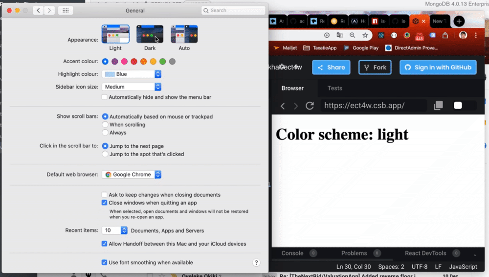

```sh
$ npm install react-hook-dark-mode
```

A React Hook to check whether the OS dark mode has been turned on.



```jsx
import useIsDark from 'react-hook-dark-mode';

function App() {
  const isDark = useIsDark();
  return (
    <div className="App">
      <h1>Color scheme: {isDark ? "dark" : "light"}</h1>
    </div>
  );
}
```

Try it out [here](https://codesandbox.io/s/useisdark-ect4w)!
